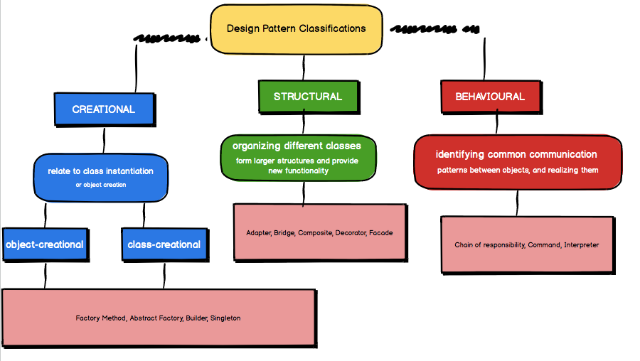

## We Don’t Build Software From Scratch Anymore

When people think about software engineering, a lot of them picture someone sitting alone in front of a computer, writing thousands of lines of code from a blank screen. But the reality is pretty different nowadays. We don’t build software from the ground up every time anymore. Instead, we rely heavily on frameworks, libraries, APIs, and of course, design patterns. It’s not about reinventing the wheel. It’s about taking what already works and adapting it to fit new situations. In a way, it’s similar to building a house—you’re not inventing bricks or windows every time; you're using existing materials to create something that fits the current needs. Software engineering today is less about making something brand new and more about knowing how to piece together proven ideas into a strong, reliable structure. And that’s where understanding design patterns becomes critical.

## More Than Just Writing Code

Our job as software engineers is bigger than just sitting down and hammering out code line after line. Sure, writing code is part of it, but that's not the main point. What we’re actually doing is solving problems. And not just any problems we’re solving problems efficiently, predictably, and reliably. That’s why it’s good that software engineering has evolved to be what it is today, a field where finding solutions is valued over constantly trying to invent brand-new ones.Trying to come up with brand new solutions every single time would just slow everything down and create way more room for mistakes. Instead, applying known good solutions—like design patterns—helps keep things organized, efficient, and maintainable. It’s honestly more of an engineering mindset than a creative one, even though there’s creativity involved too. It’s about practical creativity, not wild invention.

## Applying Known Good Solutions

At its core, software engineering today is about applying known good solutions to real-world problems. And when we say "known good solutions," we’re talking about design patterns. These patterns have been tested, refined, and proven in tons of different scenarios over the years. They exist because a lot of smart developers kept running into the same types of problems and figured out the best ways to handle them.
By learning design patterns, you’re basically building a toolbox of reliable strategies you can use when you run into a familiar situation. It’s like having a set of blueprints for different types of bridges—you don't have to invent a new kind of bridge every time you need to cross a river. You choose the right design based on the situation, maybe tweak it a little depending on the environment, and then build it with confidence that it will hold up.

## Understanding and Adapting Patterns

Learning design patterns isn’t just about memorizing them. It’s about understanding the why behind each pattern and figuring out when and how to use them. Not every pattern fits every situation perfectly, and sometimes you’ll need to adapt a pattern to fit the problem you're solving. That’s where the real skill comes in.Understanding patterns teaches you to think about architecture and structure before you start typing out code. It shifts your focus from "how fast can I code this?" to "what's the best, most maintainable way to solve this problem?" And once you get into the habit of thinking this way, your code naturally becomes cleaner, easier to debug, and easier for your teammates (and your future self) to understand and maintain.At the end of the day, patterns aren’t about forcing you to do things one specific way—they're about giving you a reliable starting point and a shared language with other developers. They help you move faster and build better systems because you’re standing on the shoulders of everyone who figured this stuff out before you.

The essay above used ChatGPT for spelling and grammar corrections/suggestions
