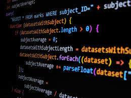

## First Steps In Typescript

Before this class, I had never heard of or touched TypeScript or JavaScript, so I had a lot of learning to do in just under a week when I was first introduced to it. I was scared at first to learn a new language, as I had only just learned C and the basics of C++ this past semester. But I had a sigh of relief whilst I was going through the TypeScript and JavaScript courses respectively and found out that TypeScript wasn't so bad. I quite liked the fact that in TypeScript, it checks at compile time, similarly to C and C++, which I find to be one of the simple things that are very helpful and save you time.

## Practicing through WOD's

I enjoy the structure of ICS 314 and how weekly we will do these things called WODs, which are basically in-class exercises that are timed. The time is determined by the professors and how difficult it is. The WODs give us a prompt that asks us to code a certain thing based on what is asked in TypeScript Playground, then we test our code through the test cases provided. They are meant to challenge our knowledge of TypeScript and what we are learning through short hands-on practice, which I personally like a lot more than long homework assignments that you have to do on your own time. By doing the WODs in class and then having the professor go over how to do it with everyone and taking questions is, in my opinion, the best way you can try and teach coding to someone. It gives you a test of your knowledge, and then you can immediately learn afterwards what you should have done to correctly write a program based on the prompt.

## Why TypeScript Matters

I believe that TypeScript is a good language from a software engineering perspective; it's very similar to other languages that you may have learned beforehand, and it also mixes in new helpful things. One of the things I like about TypeScript is how well it integrates with modern development tools, providing features like auto-completion and real-time error checking, which make coding more efficient and enjoyable. These features help catch mistakes early and allow for a smoother development process, especially when working on larger projects where maintainability is crucial. However, I did notice that setting up TypeScript can take some effort compared to JavaScript, with the need for configuration and transpilation. Despite this, I think the added benefits of static typing and improved code reliability make it worth it in the long run. While it might seem like extra work initially, it ultimately helps create more robust and scalable applications, making it a valuable choice for many software engineering projects.

The essay above used ChatGPT for spelling and grammar corrections/suggestions
