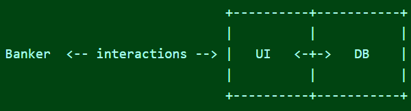

  

For this project, developed for the ICS 212 course, I created a bank database application program designed to function as a database system for a bank. The program was initially created in C and later converted to C++, enhancing its features and functionality. The primary goal of this project was to implement a linked list-based database system that stores user account information in a file, allowing users to interact with the system via a user-friendly interface. The application includes core functionalities such as adding new records, printing all records, finding specific records by account number, and deleting records. Upon startup, the program reads data from a specified text file, creating it if it does not exist, and upon exit, it writes the updated data back to the file. The C++ version introduced better encapsulation, error handling, and object-oriented programming concepts, improving maintainability and scalability.

I was solely responsible for the entire development process of this project, which I completed independently. My work involved not only writing code but also designing a robust architecture that ensured efficient data storage and retrieval. One of the key aspects of the project was implementing object-oriented principles such as encapsulation and abstraction to better manage the complexity of the database operations. I utilized C++ features like classes and stream-based file handling to replace traditional C functions, enhancing readability and maintainability. Another critical part of my responsibilities was implementing a debug mode using preprocessor directives, which allowed for easier identification of potential issues during development. Ensuring that the program compiled correctly in both debug and release modes was also a priority, requiring me to create separate makefiles tailored for each mode.

Through this project, I gained valuable experience in designing and implementing database applications in both C and C++. I learned the importance of proper memory management using C++'s dynamic memory allocation instead of C's malloc/free functions. This project also reinforced my understanding of file handling using C++ streams, encapsulation using classes, and best practices in software design. Converting the program from C to C++ provided insight into the benefits of object-oriented programming over procedural programming. I developed my debugging skills by implementing preprocessor directives for a debug mode, which provided insights into function calls and parameter values. Furthermore, working on this project highlighted the significance of thorough testing and planning before coding, which ultimately helped minimize errors and streamline development. Overall, this project provided me with a comprehensive understanding of creating a functional database application from the ground up.
