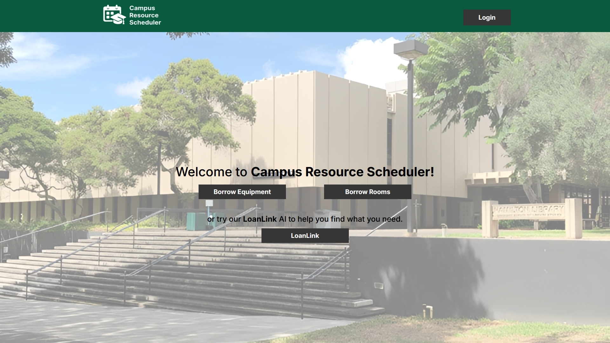
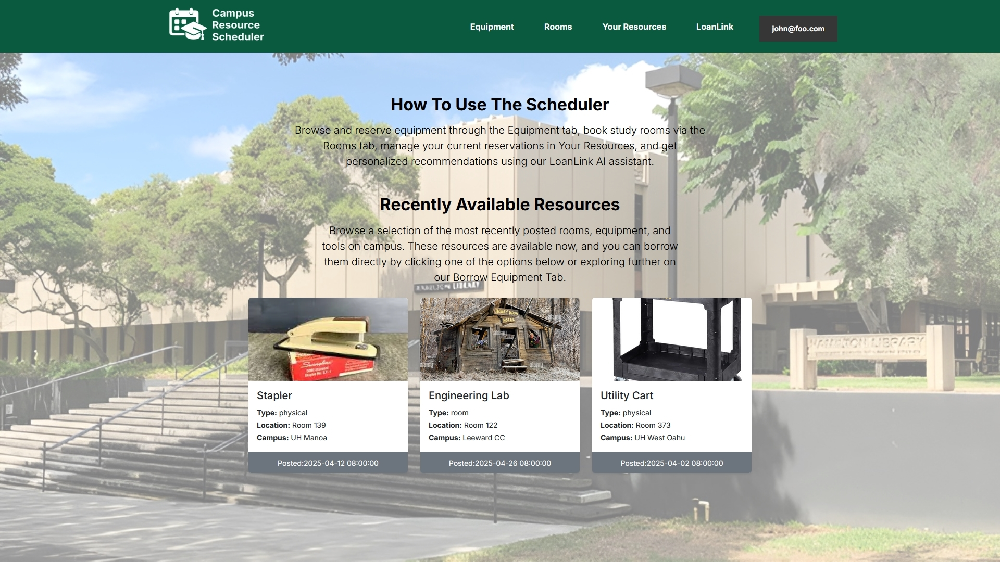
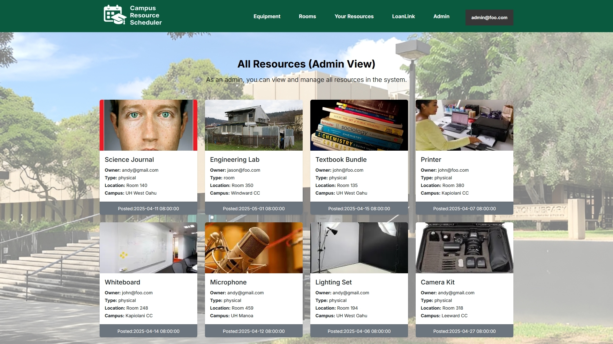

  

## Overview

Campus Respurce Scheduler is a web application developed for the students adn faculty of all University of Hawaii campuses. The main fucntion of the website is to have all resources tath someone attedning a Univery of Hawaii Campus can see what resources are available to them to borrow adn use for themselves. It is a hub that contains boht physical resources and locational resources who may need it for a set amount of time. It allows the user to schedule, manage, and return resources through a user friendly interface. THey are also able to customise their own perosnal profile wihtin the website, by doing so they are quickly able to quickly serach for relveant resources tailord to their profile, they can also ask our AI assitant taht will direct the user based on their pormpt to the resources they may need.

## My Role

My role in this project was to work on both the user home page and admin home page as shown in the images bellow. The user home page was the first thing when a user logged into the Campus Resource Scheduler so it gives them a breif explanation of what they can do in the Campus Resource Scheduler. Then underneath that it showed 3 resources, these resoruces that were amde recently available wheter they weren;t booked yet or a differnt user ahd returned them and it's now available to be booked. The admin home page was similar as it also displays resources, the admin home page was for any admin(such as me or my four other teammates) to look at how the website was functioning and where, and when resources were booked, also who booked the resource. On the admin home page you would see all resources currently booked by a user and not owned by the admin(not currently booked).

  

  

## Lessons Learned

From this project, I learned how time-consuming it is to develop a game from scratch, not only in terms of coding but also in designing the visual aspects with sprites and images that fit the theme. We didn't have the time to create our own sprites, but even finding them online and editing their colors and appearance to match our theme was very time-consuming. This was also my first major group project where we created a game from scratch, which taught me new time management skills. As the deadline approached, we had to work outside of class to complete the project. Additionally, this experience built my skills in various areas, such as using Visual Studio Code, since I was relatively new to it. I also learned about collaboration and integration, as different people worked on different parts, and we had to ensure everything came together and was compatible in the end.

Here is the link to the Github: [Github]((https://github.com/campus-resource-scheduler-project))

Here is the link to the Website: [Website](https://campus-resource-scheduler-project.vercel.app/)
