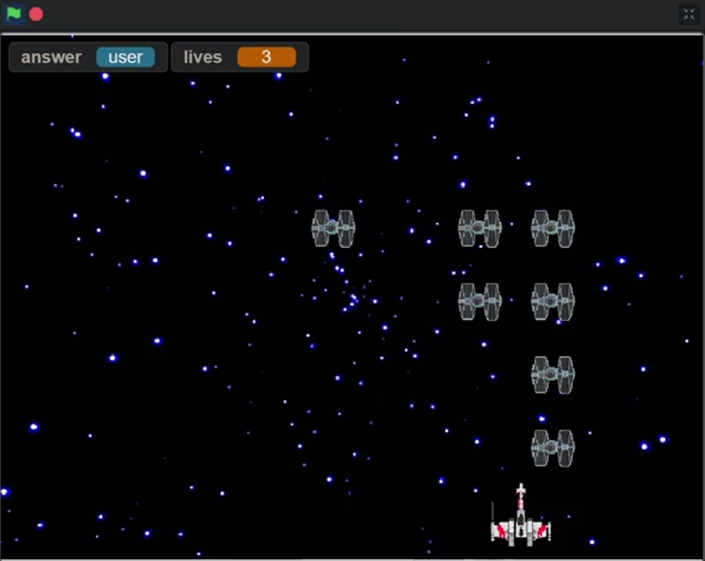

  

This is a project of mine that I did for my portfolio project in the class AP Computer Science Principles. I made this program in the IDE Scratch, which at the time was the best way for me to make this idea of mine. This project is based on the popular game Space Invaders with a Star Wars theme. It involves various interactive elements such as player controls, enemy interactions, etc. I spent hours during and outside of class checking for anything that may cause errors or would not work correctly, so I can confidently say that based on the requirements, this program works as intended with no errors.

I worked on this project independently; I spent numerous hours brainstorming and implementing my idea. All of the coding was done in Scratch. This program has four main functions, one for switching between the title, transition, gameplay, and end screen. The other three are all collision detection: one is for the missile that is shot from the X-Wing and confirms if it has hit a TIE fighter, another for the TIE fighter to see if it has been hit by the missile or if it has touched the X-Wing, and the last one for the X-Wing, confirming if it has been touched by the model of the TIE fighter. If so, it goes to the end screen, and lives go to zero.

From this project, I was able to explore Scratch more in-depth than how we were taught in class. I learned how to implement screen transitions based on certain conditions and how to implement basic collision within Scratch. This was my first big project, so it taught me the importance of debugging and testing in practice versus in concept. This was also my first lesson on effective time management for developing a coding project. I balanced time in class and outside of class in the two-week margin that we had to work on this.
